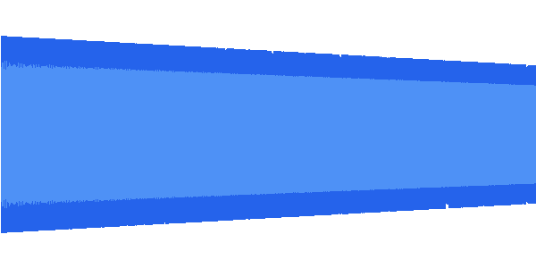
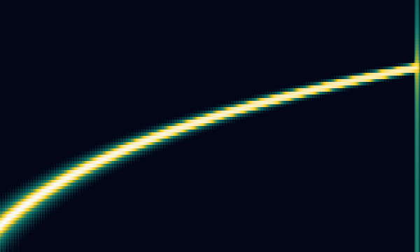

# wavedraw

[](https://www.npmjs.com/package/wavedraw)
[](https://github.com/reaperkrew/wavedraw/actions/workflows/ci.yml)
[](LICENSE)

> Wavedraw is a dependency-free wave and mel spectrogram parsing and rendering library for node.




Dependency-light WAV/AIFF parsing, waveform rendering, and Mel spectrogram rendering for Node.js. Parse chunk-aware RIFF/WAVE PCM and float audio (including `WAVE_FORMAT_EXTENSIBLE` and 64-bit float) plus AIFF/AIFF-C, summarize peaks/RMS/average waveform columns and Mel-band spectrograms, and render crisp SVG or PNG output with **zero runtime dependencies** (PNG uses Node's built-in `node:zlib` for compression).

## Features

- **Chunk-aware WAV parsing** — RIFF/WAVE with `fmt `/`data` chunk scanning; handles 8/16/24/32-bit PCM and 32/64-bit float, mono and stereo, and resolves `WAVE_FORMAT_EXTENSIBLE` (0xFFFE) via its SubFormat GUID so pro-audio exports load cleanly.
- **AIFF / AIFF-C parsing** — big-endian signed PCM (8/16/24/32-bit) and AIFC IEEE float (`fl32`/`fl64`); `drawWave`/`drawMelSpectrogram` auto-detect WAV vs AIFF by magic bytes.
- **Waveform summaries** — per-column positive/negative peaks, RMS, and average, normalized to `[-1, 1]`.
- **Mel spectrograms** — Hann-windowed FFT, Mel filter bank, and power-to-dB conversion with configurable range.
- **SVG and PNG rendering** — dependency-free SVG output and a hand-rolled PNG encoder (8-bit RGBA) for both waveforms and spectrograms.
- **Pure, typed API** — functional core with side effects pushed to the edge; full TypeScript types and ESM output.
- **Small by design** — `npm audit` clean, no native modules, no canvas or font stack.

## Installation

```bash
npm install wavedraw
```

Requires Node.js 20 or newer.

## Quick start

Render a waveform to SVG in one call:

```ts
import { drawWave } from "wavedraw";

await drawWave("input.wav", {
  width: 600,
  height: 300,
  peaks: true,
  rms: true,
  output: "wave.svg",
  background: "#ffffff",
  colors: {
    peaks: "#2563eb",
    rms: "#60a5fa"
  }
});
```

## Rendering PNG output

Any render target that accepts an `output` path will emit PNG instead of SVG when the path ends in `.png` (or when `format: "png"` is set). The return value mirrors the format: a `string` for SVG, a `Uint8Array` for PNG.

```ts
import { drawWave } from "wavedraw";

const png = await drawWave("input.wav", {
  width: 600,
  height: 300,
  peaks: true,
  rms: true,
  output: "wave.png",
  background: "#ffffff",
  colors: { peaks: "#2563eb", rms: "#60a5fa" }
});

png; // Uint8Array containing the encoded PNG bytes
```

For lower-level control, call the renderers directly:

```ts
import { readWavFile, summarizeWaveform, renderWaveformSvg, renderWaveformPng } from "wavedraw";

const audio = await readWavFile("input.wav");
const waveform = summarizeWaveform(audio, {
  width: 1200,
  channel: "mix",
  metrics: ["peaks", "rms"]
});

const svg: string = renderWaveformSvg(waveform, {
  width: 1200,
  height: 300,
  background: "#ffffff",
  layers: {
    peaks: { color: "#2563eb", strokeWidth: 1 },
    rms: { color: "#60a5fa", strokeWidth: 1 }
  }
});

const png: Uint8Array = renderWaveformPng(waveform, {
  width: 1200,
  height: 300,
  background: "#ffffff",
  layers: {
    peaks: { color: "#2563eb", strokeWidth: 1 },
    rms: { color: "#60a5fa", strokeWidth: 1 }
  }
});
```

## Extracting waveform data

Skip rendering entirely to get column data as JSON-serializable structures. This is useful when you want to ship summaries to a browser client for your own rendering, or store them for later analysis.

```ts
import { readWavFile, summarizeWaveform } from "wavedraw";

const audio = await readWavFile("input.wav");
const waveform = summarizeWaveform(audio, {
  width: 1200,
  channel: "mix",
  metrics: ["peaks", "rms", "average"],
  startSeconds: 0,
  endSeconds: 30
});
```

Each column carries a `min`/`max` peak pair (normalized `-1..1`) plus optional `rms` and `average` values:

```ts
interface WaveformColumn {
  min: number;      // negative peak, -1..1
  max: number;      // positive peak, -1..1
  rms?: number;     // root-mean-square, 0..1
  average?: number; // mean sample, -1..1
}
```

## Selecting a time range

`startSeconds` and `endSeconds` (or the `start`/`end` shorthand on `drawWave`) let you zoom into a region. `drawWave` also accepts `"START"`/`"END"` keywords and `HH:MM:SS` strings for compatibility.

```ts
import { drawWave } from "wavedraw";

await drawWave("input.wav", {
  width: 1200,
  height: 300,
  start: 30,           // seconds, or "00:00:30"
  end: 90,             // seconds, or "00:01:30"
  output: "intro.png",
  format: "png"
});
```

## Handling multi-channel audio

Use `channel: "mix"` to downmix all channels into a single summary, `channel: <n>` to target one channel, or `channel: "all"` to get one summary per channel:

```ts
import { readWavFile, summarizeWaveform } from "wavedraw";

const audio = await readWavFile("stereo.wav");

const mixed = summarizeWaveform(audio, { width: 1200, channel: "mix" });
const left = summarizeWaveform(audio, { width: 1200, channel: 0 });
const perChannel = summarizeWaveform(audio, { width: 1200, channel: "all" });
```

## Mel spectrograms

Render a Mel spectrogram to SVG or PNG with the same shape:

```ts
import { drawMelSpectrogram } from "wavedraw";

await drawMelSpectrogram("input.wav", {
  width: 1200,
  height: 360,
  fftSize: 1024,
  melBands: 80,
  minFrequency: 20,
  maxFrequency: 8000,
  dynamicRangeDb: 80,
  output: "mel-spectrogram.png",
  background: "#020617",
  colors: ["#020617", "#0f766e", "#facc15", "#f8fafc"]
});
```

Use `summarizeMelSpectrogram()` for normalized Mel-band data, or `renderMelSpectrogramSvg()` / `renderMelSpectrogramPng()` when you already have a summary.

## API reference

### High-level draw helpers

| Function | Returns | Description |
| --- | --- | --- |
| `drawWave(path, options)` | `Promise<string \| Uint8Array>` | Read a WAV, summarize, render SVG/PNG, optionally write to disk. |
| `drawMelSpectrogram(path, options)` | `Promise<string \| Uint8Array>` | Same shape for Mel spectrograms. |

### Parsing and analysis

| Function | Description |
| --- | --- |
| `readWavFile(path, options?)` | Read and parse a WAV file from disk into a `WavAudio`. |
| `parseWav(buffer, options?)` | Parse a `Buffer`/`ArrayBuffer`/`Uint8Array` into a `WavAudio`. |
| `readAiffFile(path)` | Read and parse an AIFF/AIFF-C file from disk into a `WavAudio`. |
| `parseAiff(buffer)` | Parse a `Buffer`/`ArrayBuffer`/`Uint8Array` into a `WavAudio`. |
| `loadAudio(path)` | Read a file and dispatch to `parseWav` or `parseAiff` by magic bytes. |
| `parseAudio(buffer)` | In-memory dispatcher: `RIFF` → `parseWav`, `FORM` → `parseAiff`. |
| `summarizeWaveform(audio, options)` | Per-column peaks/RMS/average summary. |
| `summarizeMelSpectrogram(audio, options)` | Normalized Mel-band spectrogram summary. |

### Renderers

| Function | Returns |
| --- | --- |
| `renderWaveformSvg(summary, options)` | `string` |
| `renderWaveformPng(summary, options)` | `Uint8Array` |
| `renderMelSpectrogramSvg(summary, options)` | `string` |
| `renderMelSpectrogramPng(summary, options)` | `Uint8Array` |

All option types are exported: `DrawWaveOptions`, `DrawMelSpectrogramOptions`, `RenderWaveformSvgOptions`, `RenderWaveformPngOptions`, `RenderMelSpectrogramSvgOptions`, `RenderMelSpectrogramPngOptions`, `WaveformLayerStyle`, `SummarizeWaveformOptions`, `SummarizeMelSpectrogramOptions`.

## Supported WAV input

- RIFF/WAVE PCM and IEEE float with chunk-aware parsing.
- Mono and stereo.
- 8-bit unsigned PCM.
- 16-bit signed PCM.
- 24-bit signed PCM.
- 32-bit signed PCM.
- 32-bit float WAV.
- 64-bit float WAV.
- `WAVE_FORMAT_EXTENSIBLE` (0xFFFE) resolved via SubFormat GUID.

## Supported AIFF input

- AIFF (uncompressed) big-endian signed PCM, 8/16/24/32-bit.
- AIFF-C with `NONE`/`twos`/`sowt` (PCM) or `fl32`/`fl64` (IEEE float) compression.
- Mono and multi-channel.
- `drawWave`/`drawMelSpectrogram` accept either container; use `parseAudio`/`loadAudio` to dispatch by magic bytes.

## Dependency policy

The core package ships **zero runtime dependencies**. WAV parsing, waveform analysis, SVG rendering, and PNG encoding are all implemented locally. The PNG encoder uses Node's built-in `node:zlib` for IDAT compression (part of the Node runtime, not a dependency). This keeps the install footprint tiny and the audit surface minimal.

## Development

```bash
npm install        # install dev dependencies
npm run lint       # tsc --noEmit
npm run test       # vitest run
npm run build      # clean + tsc emit to dist/
npm run check:lengths  # enforce <=300 line files, <=20 line function bodies
npm audit          # must report no high/critical vulnerabilities
```

### Contributing

Work happens on feature branches and lands via pull request — `main` is never committed to directly and must stay releasable at all times. To contribute:

1. Branch off the latest `main`: `git checkout main && git pull && git checkout -b feat/your-feature`.
2. Keep source files under 300 lines and function bodies under 20 lines (`npm run check:lengths` enforces both).
3. Prefer pure functions and small submodules; push side effects to the edges.
4. Use [conventional commits](https://www.conventionalcommits.org/) and update submodule READMEs when behavior changes.
5. Ensure `npm run lint`, `npm test`, `npm run check:lengths`, and `npm audit` all pass before opening a PR.

## License

[MIT](LICENSE) © reaperkrew
